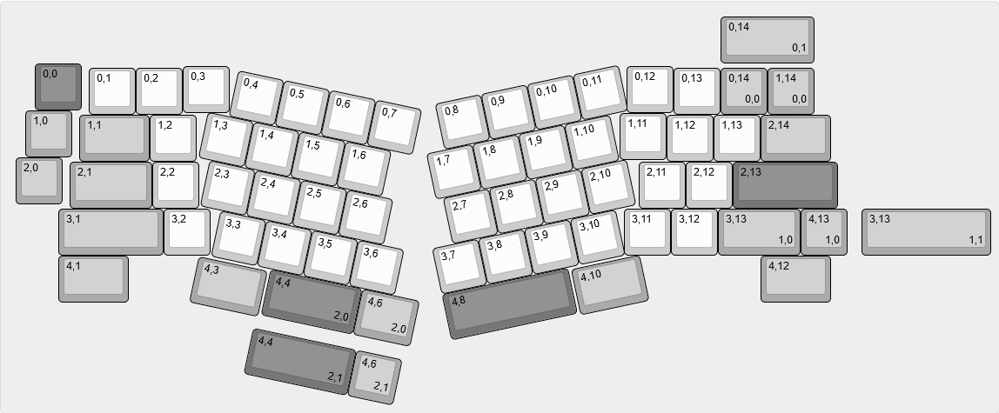
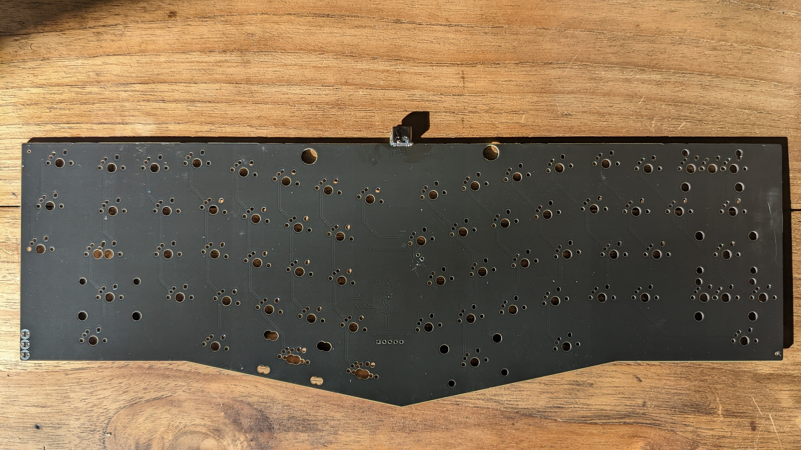
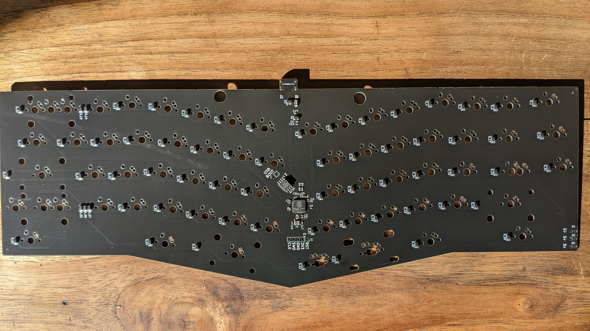
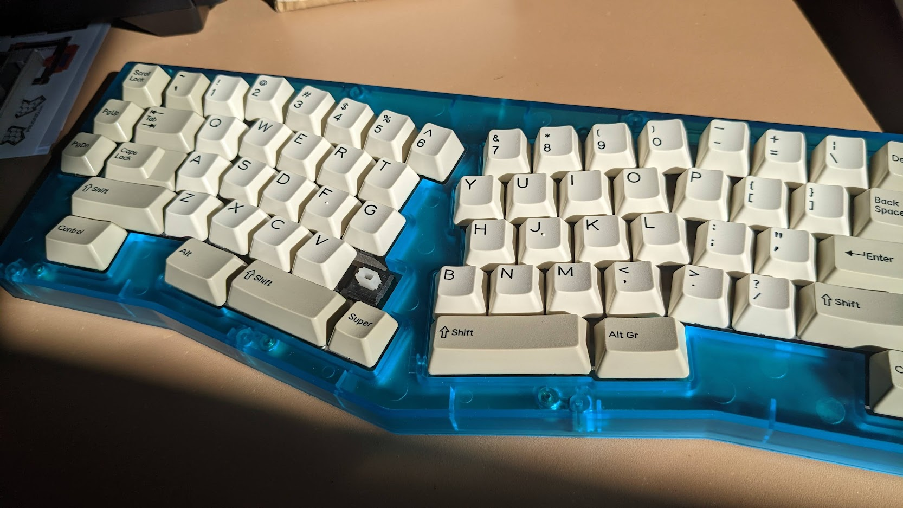

# Alicia
Alice compatible PCB - Opensource based of RP2040 IC

## Production files

The available files were generated to make the PCB by JLCPCB. Also, an Alps plate file is available in the folder `Plates`. Both folder of files have been tested and a complete keyboard has been made.

## Firmware

A precompiled `.uf2` file is available for programming via QMK Vial. Also a folder to produce the file via QMK is available (RP2040 QMK needed).
